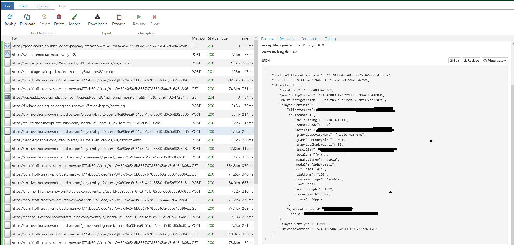
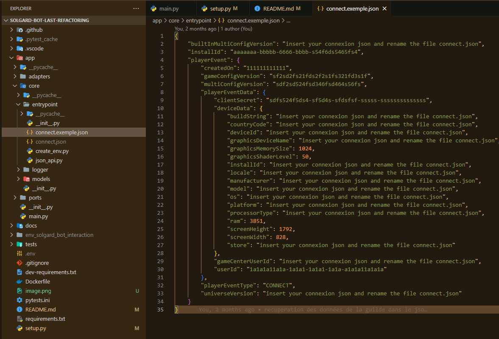
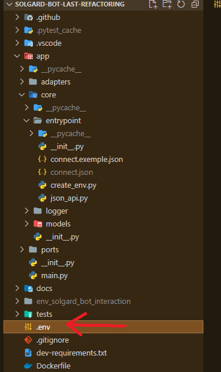

# Solgard Discord Bot

Welcome to the Solgard Discord Bot repository. This bot is designed to bring a range of useful features to Discord servers for the game [Solgard](https://snowprintstudios.com/solgard/).

## Features

- **Connect:** Connect to the game using Python.
- **Attacks/Bombs Remaining:** The bot can display the remaining bombs and attacks on Discord.
- **Clash Info:** The bot can provide information about the remaining attacks and the current score on Discord.
- **Interpolate Powers:** The bot utilizes machine learning to predict powers for clashes, with multiple implementations.
- **Assign Target Clash:** Uses the Kuhn Munkres algorithm to minimize power differences and assign targets for clashes.
- **Translation:** The bot can communicate in French, English, Italian, Spanish, Chinese, and Russian.

## Prerequisites

Before you can use the Solgard Discord Bot, there are a few tools that you need to have installed on your system:

1. **Python:** This bot is built with Python, and you will need to have it installed to run it. You can install Python [here](https://www.python.org/downloads/).
2. **VSCode:** This is a code editor that you can use to interact with the bot's code. You can download it [here](https://code.visualstudio.com/download) and find a getting started tutorial [here](https://code.visualstudio.com/docs).
3. **Git:** Git is a version control system that lets you interact with this repository. You can download it [here](https://git-scm.com/downloads) and find a tutorial on how to use it [here](https://git-scm.com/doc).

## Installation

1. **Clone the repository**

   Run the following command in your terminal to clone this repository:

   ```bash
   git clone https://github.com/AlexTraveylan/solgard-bot-last-refactoring.git
   ```

2. **Install the dependencies**

    Navigate into the cloned repository, create and activated venv and install dependencies :

    - windows
    ```powershell
    cd solgard-bot-last-refactoring
    python -m venv env
    env\Scripts\activate
    pip install -r requirements.txt
    ```
    - linux
    ```bash
    cd solgard-bot-last-refactoring
    python -m venv env
    source env/bin/activate
    pip install -r requirements.txt
    ```


3. **Set entrypoint**

    - **Get your config file** : You need to recup your CONNECT file from the game, for that you have to use a mitm, [here](https://www.garyjackson.dev/posts/intercepting-ios-communication/) [here2](https://hackernoon.com/intercept-https-traffic-on-a-android-emulator-46023f17f6b3). You can download mitmproxy for that [here](https://mitmproxy.org/)

    - Here an example of CONNECT file
    <p align="center">
    
    </p>

    - open the file app/core/entrypoint/connect.exemple.json like this :
    <p align="center">
    
    </p>
    - rename the file connect.exemple.json in connect.json
    - insert your CONNECT json recupered with mitm proxy.

4. **Set your .env file**

    - Open the file create_env.py.
    <p align="center">
    
    </p>
    - Execute it.
    - You .env is created, you connect.json is now encrypted in the .env, use that for environnement variable for deployement.
        <p align="center">
    
    </p>
    - Add your bot token : `BOT_TOKEN=your-bot-token-here`.
     
4. **Run the bot**

    You can now run the bot using the following command:

    ```python
    python app/main.py
    ```

    You can also run the file main.py.
5. **Production**

    It is ready to be deployed online. I suggest you use [Railway](https://railway.app/). It's really easy to set up if you are using githhub and the environment variables are stored in the .env file. You just need to copy them over.

## Contributing

We welcome contributions to the Solgard Discord Bot! 
- AlexTraveylan
- Soear

## License

This project is open source. Fell free to copy it, modify it, or use it like you want.

## Contact

If you have any questions, comments, or concerns, feel free to open an issue on this repository.
You can contact me in discord too, my name : AlexTraveylan (alextraveylan)

## Autodoc

You can read auto generate documentation localy opening the file : "docs\_build\html\index.html" in your navigator !
But its not really good ... open the files and read docstring is beter !


